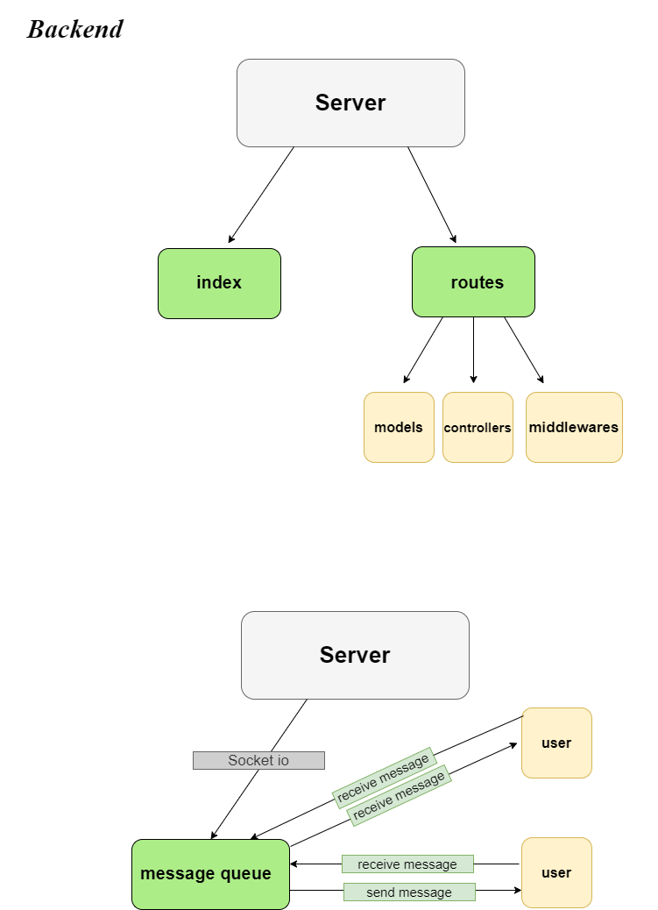
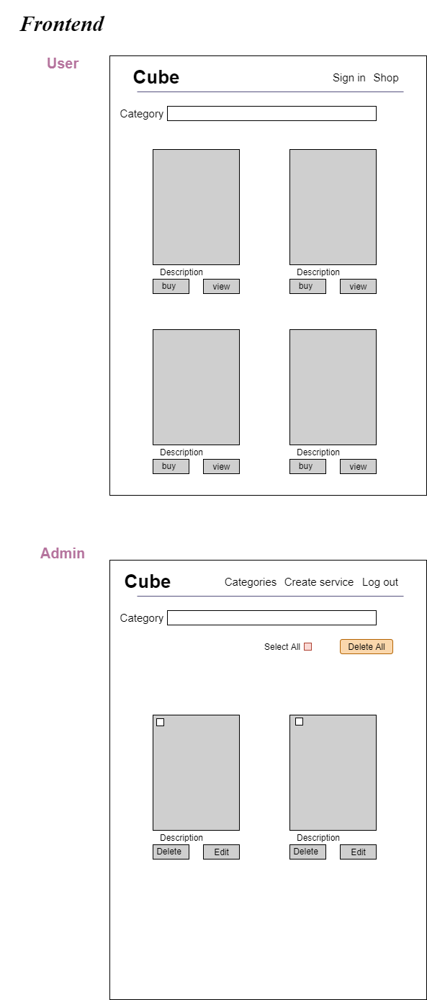

# cube-backend

# Cube

## Team Name:Tech geek team
* Project Name: Cube
* Idea: Ecommerce web app where any engineer can promote their profile/works and be able to find 
* and search for Books,tools,services and courses offers.

## Team Member .

1 - Razan Alamleh.

2 - Yazan Baker .

3 - Sultan Eleyan.

4 - Qusai ALQaisi .

1- As an admin user, I want the ability to add my profile to the page
Feature Tasks: Fill in the form and press submit.

Acceptance Tests: After submission, look in the profile page if it has been added.

2- As an admin user, I want the ability to login in to my profile
Feature Tasks: Continue with google option

Acceptance Tests: After pressing the login button, the developer user is able to enter using his auth.

3- As an  user, I want the ability to view jobs from around the world
Feature Tasks: The developer clicks on the find a category button on the find the page

Acceptance Tests: After pressing, he will receive the catogry in a card form database.

3- As an developer user, I want the ability to contact the site owners
Feature Tasks: the customers fills a form msg and chat with the admin.
Acceptance Tests: the letter and email will be saved in the database

4- As a user, I would want to be able to view all catogry.
Feature Tasks: the user goes to the find catogry page and looks for adequate cates.

Acceptance Tests: the user should be able to see the description , contact, image of the catogry and be able to bay him

What is the vision of this product?
This product will be able to connect Engineers and job requirment on one platform and be able to allow the Engineer to apply to bay waht they need from catogry . 

The Engineer will also be able to create his own profile and add it on the website and be able to bay what he want from the catogry.

What pain point does this project solve?
This project eases the process for an upcoming or current engineer in order to bay his staff online and get exposed by others . This project will also allow the engineer to search for service and apply to them and hopefully get servied  soon.

Why should we care about your product?
You should care about our product because this product will make life much easy for the enigneer and reduce they losting time for searching .

What will your MVP functionality be?
Our MVP will display the layout of the project and the basic functionalities on how catogry will be displayed and selected.

What are your stretch goals?
to make chat stream to allow all the user to connect togather in same place .

Functional Requirements:
The engineer/user will enter the website, Signup to the website, then proceed to Login to the page, and be able to view products. 
 
After that he wil buy the product/book and end the purchase process.
 
He will have a chat feature where he's able to chat to customer service.
 
Security:
We will be using bcrypt and base-64 package to secure the sent passwords
from the client to the server and then decryption to better validate the user login info.
 
Usability:
The website is very starter friendly. The reason for that is it is very basic in its design and its functionality. THe website will include step 1, step 2 layout where the user will be able to easily signup, add his resume and apply for jobs in three simple clicks.

## UML 

## Test .

**signup**

    "username":"qusadddi",
    "password":"ff22ff",
    "role":"admin"

**seller**

    "username":"seller",
    "password":"test2",
    "role":"seller"

**buyer**

     "username":"buyer",
     "password":"test1",
     "role":"buyer"

**products schema**

    "title": "car",
    "image":"car",
    "description":"car fix",
    "phoneNumber":"089090909"

## Routes
 * product/mechanic
 * product/architec
 * product/electric
 * product/civil

## Presentation Link

[Cube presentation](https://www.canva.com/design/DAEpPQT-Jes/share/preview?token=LR-EujvrUf6dq89rQUlqBg&role=EDITOR&utm_content=DAEpPQT-Jes&utm_campaign=designshare&utm_medium=link&utm_source=sharebutton)

## Heroku Deployment
[Heroku Deployment Link](https://cube-engineer.herokuapp.com)

**Best reagrds**

> From Tech-geek-team.

